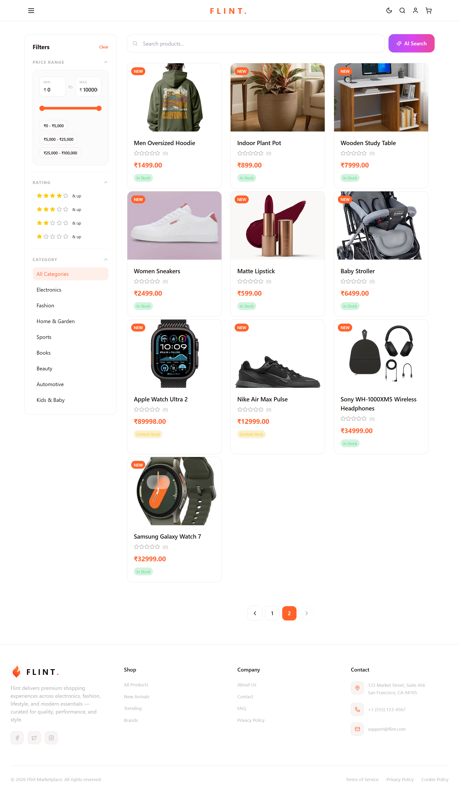
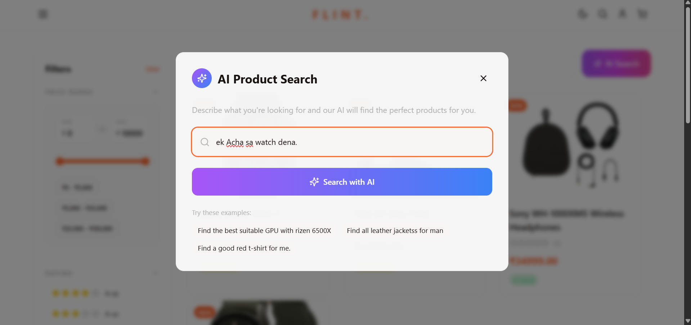
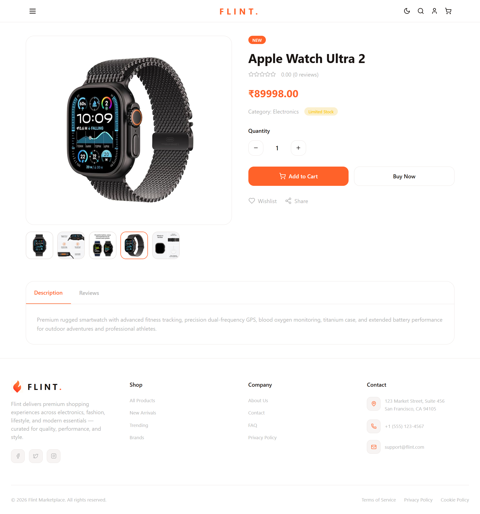
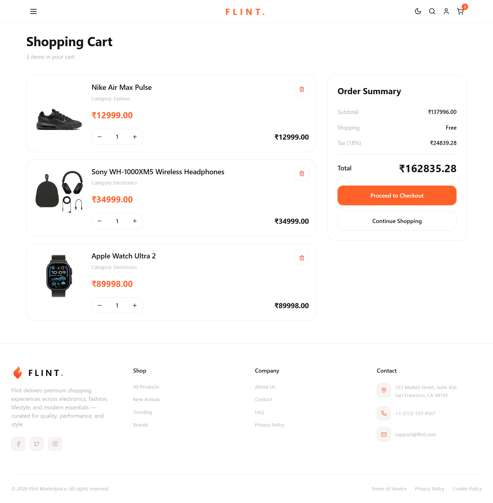
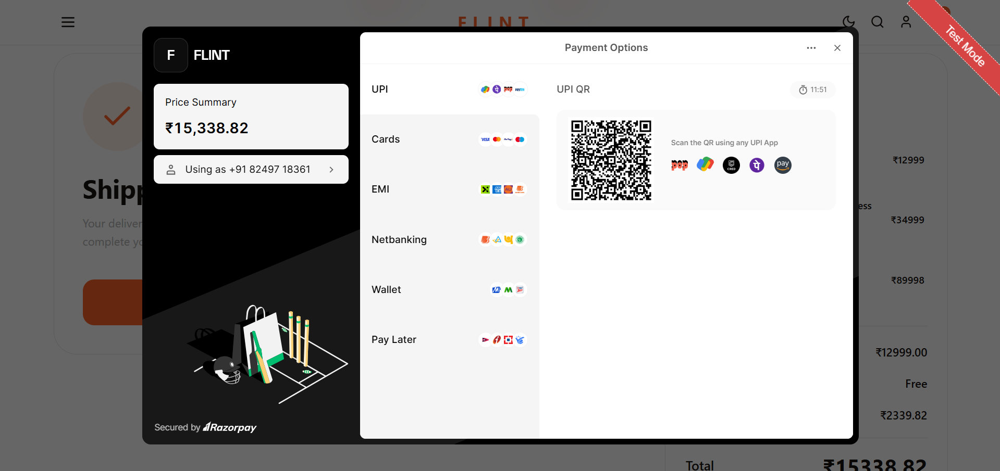
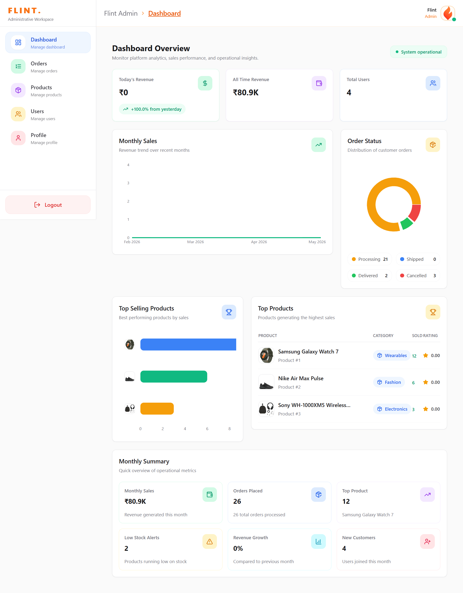
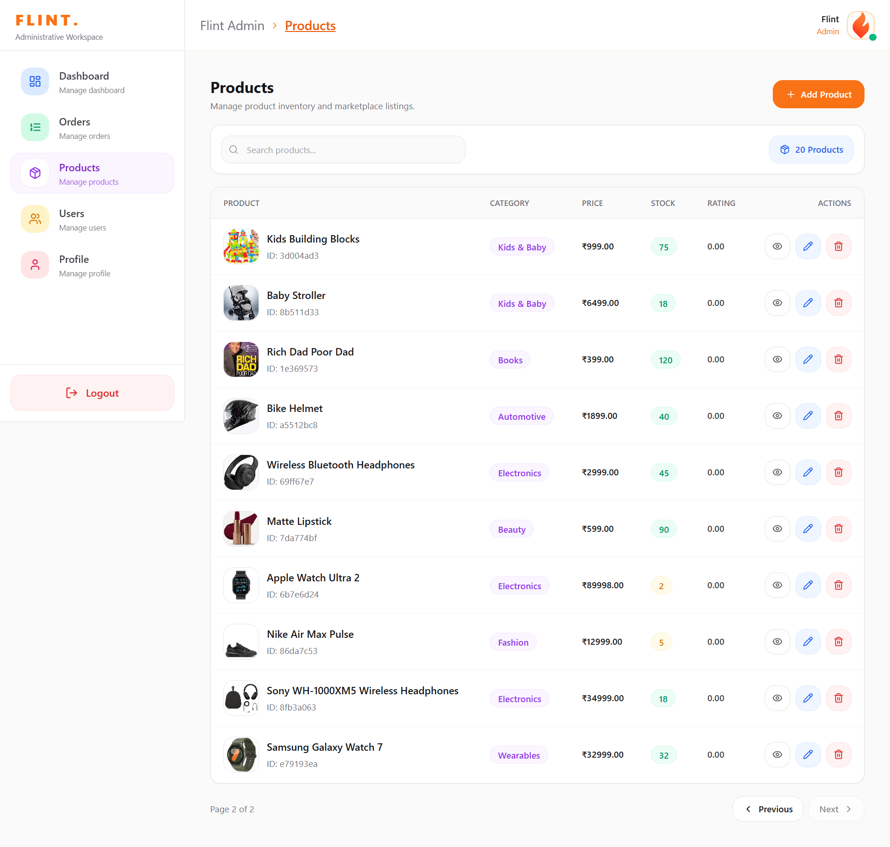

# Flint — Full-Stack E-Commerce Platform

> A production-inspired full-stack e-commerce platform built with the PERN stack, featuring a hybrid SQL + Gemini recommendation engine, Razorpay-integrated checkout workflows, and a dedicated administrative workspace.

---

## Standout Engineering Features

* Transactional PostgreSQL order placement workflows
* Dedicated administrative dashboard with analytics and lifecycle management
* Raw SQL architecture without ORM abstraction
* Razorpay-integrated payment settlement flow
* Role-based multi-application architecture
* Centralized Redux Toolkit state management
* Hybrid SQL + Gemini product recommendation engine
* PostgreSQL relational schema with enforced foreign key constraints

---

## Live Demo, Repository & Documentation

| Resource              | Link          |
| --------------------- | ------------- |
| Frontend (Storefront) | *coming soon* |
| Admin Dashboard       | *coming soon* |
| Backend API           | *coming soon* |

### Detailed Engineering Documentation

| Documentation                            | Description                                                                                                                   |
| ---------------------------------------- | ----------------------------------------------------------------------------------------------------------------------------- |
| [`server/README.md`](./server/README.md) | Backend architecture, PostgreSQL workflows, authentication, Razorpay integration, AI recommendation engine, and API internals |
| [`client/README.md`](./client/README.md) | Storefront architecture, Redux workflows, checkout lifecycle, cart management, and UI system                                  |
| [`admin/README.md`](./admin/README.md)   | Administrative dashboard architecture, analytics workflows, product lifecycle management, and operational interfaces          |

---


---

## Screenshots

### Homepage / Hero Section


### Product Discovery & Filters


### AI Recommendation Modal


### Product Detail Page


### Cart & Checkout Flow


### Razorpay Payment Workflow


### Admin Dashboard Analytics


### Product Management Workspace

## Table of Contents

* [Project Overview](#project-overview)
* [Tech Stack](#tech-stack)
* [Architecture](#architecture)
* [Key Features](#key-features)
* [Database Schema](#database-schema)
* [API Reference](#api-reference)
* [Project Phases & Git History](#project-phases--git-history)
* [Engineering Decisions](#engineering-decisions)
* [Getting Started](#getting-started)
* [Environment Variables](#environment-variables)
* [What I Learned](#what-i-learned)

---

## Project Overview

Flint is a full-stack multi-role e-commerce platform built from scratch using PostgreSQL, Express, React, and Node.js. The system supports three independent applications sharing a centralized backend API:

| Application | Technology                              | Purpose                    |
| ----------- | --------------------------------------- | -------------------------- |
| `server/`   | Node.js + Express + PostgreSQL          | REST API + business logic  |
| `client/`   | React + Redux Toolkit + Vite            | Customer-facing storefront |
| `admin/`    | React + Redux Toolkit + Recharts + Vite | Administrative workspace   |

The project was intentionally built as a learning-through-building exercise, where architectural decisions, debugging sessions, and refactors became part of the engineering process itself.

Originally developed using MongoDB, the project was later redesigned using PostgreSQL to gain deeper experience with relational schema design, transactions, joins, foreign key constraints, and production-oriented data modeling.

---

## Tech Stack

### Backend

* Runtime: Node.js (ES Modules)
* Framework: Express.js v5
* Database: PostgreSQL (`pg` driver, raw SQL)
* Authentication: JWT + HttpOnly Cookies + bcrypt
* Validation: Joi schema validation middleware
* File Uploads: express-fileupload + Cloudinary
* Payments: Razorpay
* Email: Nodemailer
* AI Integration: Google Gemini 2.0 Flash API

### Frontend (Storefront)

* React 19 + Vite
* Redux Toolkit
* React Router v7
* Tailwind CSS v3
* Axios
* React Toastify

### Admin Dashboard

* React 19 + Vite
* Redux Toolkit
* Recharts
* Tailwind CSS v3

---

## Architecture

```text
flint-ecommerce/
├── server/
│   ├── config/
│   ├── controllers/
│   ├── middlewares/
│   ├── models/
│   ├── routes/
│   ├── utils/
│   └── validations/
│
├── client/
│   └── src/
│       ├── components/
│       ├── pages/
│       └── store/slices/
│
└── admin/
    └── src/
        ├── components/
        ├── modals/
        ├── pages/
        └── store/slices/
```

### System Flow

```text
React Applications
        ↓
Redux Toolkit State
        ↓
Axios API Layer
        ↓
Express REST API
        ↓
PostgreSQL Database
```

The backend auto-creates relational database tables on startup while respecting foreign key dependency order.

---

## Key Features

### Storefront

* JWT-based authentication and account management
* Product discovery with filtering, pagination, and keyword search
* Hybrid AI recommendation engine using SQL + Gemini ranking
* Product reviews and ratings
* Redux-powered shopping cart workflows
* Razorpay-integrated checkout and payment verification
* Customer order tracking and history
* Responsive dark/light themed storefront

### Admin Dashboard

* Secure role-gated administrative access
* Analytics dashboard with Recharts visualizations
* Product lifecycle management (CRUD + media uploads)
* Order lifecycle management and status updates
* Customer management workspace
* Responsive operational dashboard interface

---

## Database Schema

Seven relational tables with enforced foreign key constraints.

```text
users
products
product_reviews
orders
order_items
shipping_info
payments
```

### Highlights

* UUID-based order identifiers
* Transaction-safe order placement
* Foreign key relationships with cascading consistency
* One-review-per-user-per-product constraint
* Structured payment verification records

---

## API Reference

### Authentication — `/api/v1/auth`

| Method | Endpoint                 | Description          |
| ------ | ------------------------ | -------------------- |
| POST   | `/register`              | Register user        |
| POST   | `/login`                 | Login user           |
| GET    | `/logout`                | Logout user          |
| GET    | `/me`                    | Current user profile |
| PUT    | `/me/update`             | Update profile       |
| PUT    | `/password/update`       | Change password      |
| POST   | `/password/forgot`       | Send reset email     |
| PUT    | `/password/reset/:token` | Reset password       |

### Products — `/api/v1/product`

| Method | Endpoint             | Description                 |
| ------ | -------------------- | --------------------------- |
| GET    | `/all`               | Fetch products with filters |
| GET    | `/:productId`        | Single product details      |
| POST   | `/new`               | Create product              |
| PUT    | `/:productId`        | Update product              |
| DELETE | `/:productId`        | Delete product              |
| POST   | `/:productId/review` | Add review                  |
| DELETE | `/:productId/review` | Delete review               |
| POST   | `/ai/recommendation` | AI recommendation workflow  |

### Orders — `/api/v1/orders`

| Method | Endpoint           | Description         |
| ------ | ------------------ | ------------------- |
| POST   | `/new`             | Place order         |
| GET    | `/me`              | User orders         |
| GET    | `/all`             | All orders          |
| GET    | `/:orderId`        | Single order        |
| PATCH  | `/:orderId/status` | Update order status |

### Payments — `/api/v1/payment`

| Method | Endpoint        | Description              |
| ------ | --------------- | ------------------------ |
| POST   | `/create-order` | Create Razorpay order    |
| POST   | `/verify`       | Verify payment signature |

### Admin — `/api/v1/admin`

| Method | Endpoint     | Description          |
| ------ | ------------ | -------------------- |
| GET    | `/stats`     | Aggregated analytics |
| GET    | `/customers` | Registered customers |

---

## Project Phases

The project was developed across three structured engineering phases.

### Phase 1 — Backend (`v1.0-backend-complete`)

Designed and implemented the complete REST API before beginning frontend development.

Included:

* Relational schema design
* Authentication workflows
* Product management
* Review system
* Razorpay payment settlement
* Transactional order workflows
* AI recommendation engine

**Commits:** `b23c2b1` → `cf2adcd`

---

### Phase 2 — Storefront (`v2.0-storefront-complete`)

Built the customer-facing React application with centralized state management and responsive UI workflows.

Included:

* Authentication UI
* Product discovery
* AI recommendation modal
* Shopping cart workflows
* Checkout/payment flow
* Order tracking
* Responsive refinement pass

**Commits:** `388c6b5` → `504f455`

---

### Phase 3 — Admin Dashboard (`v3.0-admin-dashboard-complete`)

Built a dedicated administrative workspace as an independent React application.

Included:

* Administrative authentication
* Analytics dashboard
* Product lifecycle management
* Order management workflows
* Customer management
* Dashboard charts and operational summaries

**Commits:** `fd8a6fb` → `b563224`

---

## Engineering Decisions

### Why PostgreSQL + Raw SQL?

A deliberate choice to gain deeper understanding of relational database design, transaction management, joins, query construction, and foreign key constraints without relying on ORM abstractions.

---

### Hybrid SQL + Gemini Recommendation Engine

Instead of sending the entire product catalog to Gemini, the backend first performs keyword-based SQL filtering before passing a smaller relevant subset to Gemini 2.0 Flash for semantic ranking.

Benefits:

* Reduced API payload size
* Lower latency
* Better relevance
* Reduced token usage

---

### Transactional Order Placement

Order placement involves multiple dependent database writes:

* orders
* order_items
* shipping_info
* stock updates

All operations are wrapped inside PostgreSQL transactions to prevent partial database states.

---

### Parameterized Queries & SQL Injection Prevention

All PostgreSQL queries use parameterized placeholders (`$1`, `$2`, `$3`) instead of string interpolation to prevent SQL injection vulnerabilities and enforce safe query execution.

---

### Role-Based Multi-Application Architecture

The storefront and administrative workspace are intentionally separated into independent frontend applications while sharing a centralized backend API.

This separation simplifies:

* authorization boundaries
* deployment structure
* operational workflows
* UI responsibilities

---

## Getting Started

### Prerequisites

* Node.js 18+
* PostgreSQL 14+
* Cloudinary account
* Razorpay account
* Gemini API key

---

### Installation

```bash
git clone https://github.com/yourusername/flint-ecommerce.git
cd flint-ecommerce

cd server && npm install
cd ../client && npm install
cd ../admin && npm install
```

---

### Running in Development

```bash
# Backend API
cd server && npm run dev

# Storefront
cd client && npm run dev

# Admin Dashboard
cd admin && npm run dev
```

---

## Environment Variables

### `server/config/config.env`

```env
PORT=5000
NODE_ENV=development

DB_HOST=
DB_PORT=
DB_USER=
DB_PASSWORD=
DB_NAME=

JWT_SECRET=
JWT_EXPIRE=7d
COOKIE_EXPIRE=7

CLOUDINARY_NAME=
CLOUDINARY_API_KEY=
CLOUDINARY_API_SECRET=

RAZORPAY_KEY_ID=
RAZORPAY_KEY_SECRET=

GEMINI_API_KEY=

SMTP_HOST=
SMTP_PORT=
SMTP_EMAIL=
SMTP_PASSWORD=

FRONTEND_URL=http://localhost:5173
DASHBOARD_URL=http://localhost:5174
```

### `client/.env`

```env
VITE_BACKEND_URL=http://localhost:5000
VITE_RAZORPAY_KEY_ID=
```

---

## What I Learned

Building Flint end-to-end — without an ORM and without relying on prebuilt component systems — taught me how the full request lifecycle actually works: from Redux state and frontend interactions, through Express middleware and parameterized SQL queries, into authenticated backend workflows and rendered UI.

The most valuable learning was repeatedly diagnosing failures, identifying root causes instead of patching symptoms, and refining the architecture through iterative development. The git history reflects that progression clearly across backend, storefront, and administrative phases.

---

## License

MIT