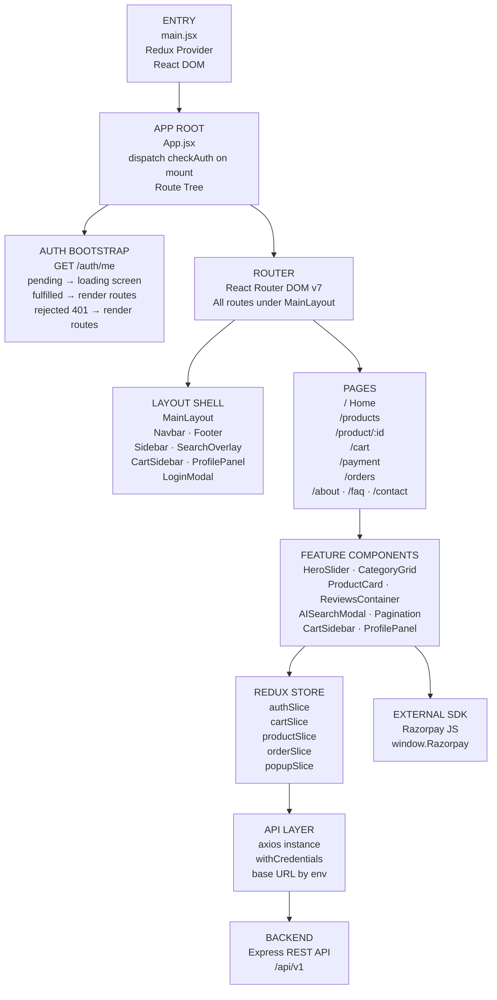
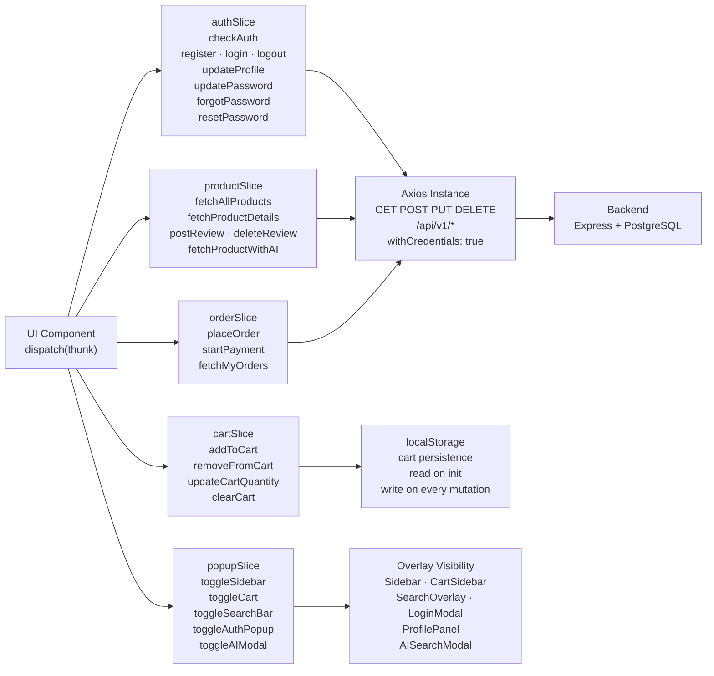
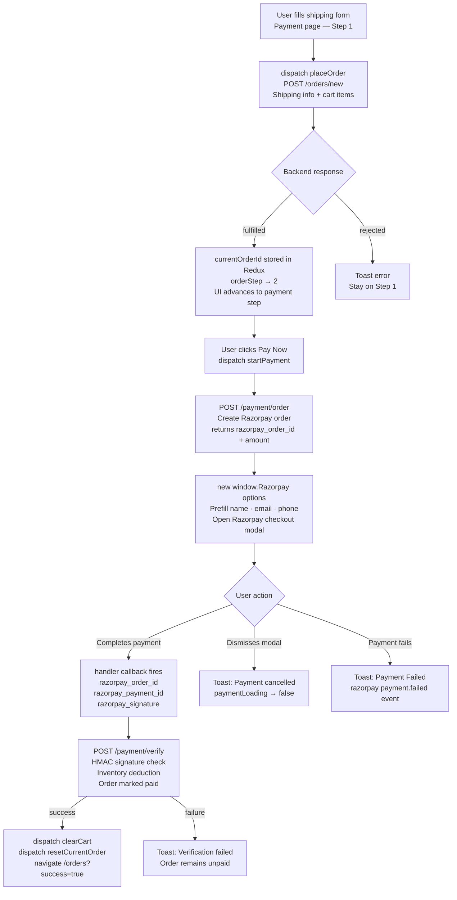

# Flint — React Frontend

> A scalable e-commerce frontend built with React 19, Redux Toolkit, and Tailwind CSS.

---

## Table of Contents

- [Overview](#overview)
- [Tech Stack](#tech-stack)
- [Project Architecture](#project-architecture)
- [Application Shell](#application-shell)
- [State Management](#state-management)
- [Pages and Routes](#pages-and-routes)
- [Component Structure](#component-structure)
- [API Integration Layer](#api-integration-layer)
- [Checkout and Payment Workflow](#checkout-and-payment-workflow)
- [Responsive Design Strategy](#responsive-design-strategy)
- [Performance Considerations](#performance-considerations)
- [Engineering Decisions](#engineering-decisions)
- [Current Limitations](#current-limitations)
- [Environment Variables](#environment-variables)
- [Installation](#installation)
- [Git Milestones](#git-milestones)

---

## Overview

The Flint frontend is a React SPA that provides the complete customer-facing interface for the Flint e-commerce platform. It communicates with the Flint backend over a versioned REST API and integrates the Razorpay checkout SDK directly for payment flows.

The project focuses on solving real frontend engineering challenges such as:

- Session-aware auth bootstrapping on app load
- Client-side cart persistence across sessions
- Multi-step checkout with coordinated Redux state
- Razorpay SDK integration and post-payment verification
- AI-assisted product discovery
- Dark/light theming via CSS custom properties

---

## Tech Stack

| Layer | Technology |
|---|---|
| Framework | React 19 |
| Routing | React Router DOM v7 |
| State Management | Redux Toolkit, React Redux |
| Styling | Tailwind CSS v3, tailwindcss-animate |
| HTTP Client | Axios |
| Icons | Lucide React |
| Notifications | React Toastify |
| Build Tool | Vite 7 |
| Linting | ESLint 9 |
| Payments | Razorpay JS SDK (CDN) |

---

## Project Architecture

```
src/
├── App.jsx                    # Root component, route tree, auth bootstrap
├── main.jsx                   # React entry point, Redux Provider mount
├── App.css                    # Global base styles
├── index.css                  # Tailwind directives, CSS custom properties
│
├── components/
│   ├── Layout/                # Shell: Navbar, Footer, overlays, panels
│   ├── Home/                  # Home page sections
│   └── Products/              # Product discovery components
│
├── contexts/
│   └── ThemeContext.jsx        # Dark/light theme context and toggle
│
├── lib/
│   └── axios.js               # Axios instance with base URL and credentials
│
├── pages/                     # Route-level page components
├── store/
│   ├── store.js               # Redux store configuration
│   └── slices/                # RTK slices: auth, cart, order, product, popup
│
├── data/
│   └── products.js            # Static seed data for UI development
│
└── public/                    # Static assets (images, logo)
```

### Frontend Architecture Diagram



### Redux Data Flow Diagram



---

## Application Shell

### Auth Bootstrap

On mount, `App.jsx` dispatches `checkAuth` before rendering any routes. This hits `GET /auth/me` to hydrate the `authUser` state from the server-side session cookie. While the check is in-flight and `authUser` is not yet resolved, a branded full-screen loading state is shown. This prevents authenticated-only routes from flashing in an unauthenticated state on page load.

```
App mount
  → dispatch(checkAuth)           [GET /auth/me]
      ├── pending  → show branded loading screen
      ├── fulfilled → set authUser, render routes
      └── rejected (401) → authUser = null, render routes  [silent]
```

401 responses from `checkAuth` are intentionally silent — they are expected when no session exists and do not trigger a toast.

### Layout

All routes are children of `MainLayout`, which composes the persistent shell:

```
MainLayout
├── Navbar            — fixed top bar with cart badge, theme toggle, search, profile
├── Sidebar           — slide-in navigation drawer
├── SearchOverlay     — full-screen search UI
├── CartSidebar       — slide-in cart panel
├── ProfilePanel      — account management drawer (profile, password, orders)
├── LoginModal        — authentication modal (login / register / forgot password)
├── <Outlet />        — active page renders here
└── Footer
```

All overlay components are rendered at the layout level and toggled exclusively via `popupSlice` actions. No local state governs visibility — this allows any component in the tree to open or close any overlay by dispatching a single action.

### Theming

`ThemeContext` applies `dark` or `light` class to the document root. Tailwind's `darkMode: ["class"]` config responds to this. All color tokens are CSS custom properties (`--background`, `--foreground`, `--primary`, etc.) resolved at the `:root` and `.dark` levels in `index.css`. Components use semantic Tailwind tokens (`bg-background`, `text-foreground`, `border-border`) rather than literal colors, making theme switching a single class toggle.

---

## State Management

The Redux store is composed of five slices.

### `authSlice`

Manages the authenticated user and all auth operation loading states.

| State Key | Type | Description |
|---|---|---|
| `authUser` | `object \| null` | Hydrated user from `/auth/me`; null when unauthenticated |
| `isCheckingAuth` | `boolean` | True during initial session check |
| `isSigningUp` | `boolean` | True during `register` |
| `isLoggingIn` | `boolean` | True during `login` |
| `isUpdatingProfile` | `boolean` | True during `updateProfile` |
| `isUpdatingPassword` | `boolean` | True during `updatePassword` and `resetPassword` |
| `isRequestingForToken` | `boolean` | True during `forgotPassword` |

**Thunks:** `checkAuth`, `register`, `login`, `logout`, `updateProfile`, `updatePassword`, `forgotPassword`, `resetPassword`

All thunks surface success and error states via `react-toastify`. The 401 case in `checkAuth` is suppressed.

---

### `cartSlice`

Manages the client-side shopping cart with `localStorage` persistence.

| Action | Behavior |
|---|---|
| `addToCart` | Adds item or increments quantity; quantity is capped at `product.stock` |
| `removeFromCart` | Removes item by product ID |
| `updateCartQuantity` | Sets quantity; clamped between 1 and `product.stock` |
| `clearCart` | Empties cart; called after successful payment verification |

Cart state is initialized by reading from `localStorage` on slice creation and written back on every mutation. The cart is deliberately client-side only — no server-side cart API. Duplicate product protection and stock capping are enforced in the reducer, but the backend independently merges duplicate cart entries during order creation.

---

### `productSlice`

Manages product catalogue state including paginated listings, single product details, reviews, and AI search results.

| State Key | Description |
|---|---|
| `products` | Current page of products (also overwritten by AI search results) |
| `productDetails` | Single product with reviews |
| `productReviews` | Mutable review list for the active product |
| `totalProducts` | Total count for pagination |
| `topRatedProducts` | Injected from `fetchAllProducts` response |
| `newProducts` | Injected from `fetchAllProducts` response |
| `loading` | Shared loading flag for product list and detail fetches |
| `aiSearching` | Dedicated loading flag for AI recommendation requests |
| `isPostingReview` / `isReviewDeleting` | Granular review operation flags |

**Thunks:**

- `fetchAllProducts` — accepts filter params (`category`, `price`, `ratings`, `availability`, `search`, `page`) and constructs query string
- `fetchProductDetails` — fetches single product by ID; populates `productReviews` from response
- `postReview` — optimistically prepends new review to `productReviews` on fulfillment
- `deleteReview` — filters deleted review from `productReviews` by ID on fulfillment
- `fetchProductWithAI` — posts natural language prompt to `/product/ai/recommendation`; overwrites `products` with AI-ranked results and dispatches `toggleAIModal()` to close the search modal

---

### `orderSlice`

Manages the full checkout lifecycle from order creation through Razorpay payment.

| State Key | Description |
|---|---|
| `myOrders` | Customer's historical orders |
| `currentOrderId` | Server-assigned order ID after `placeOrder` succeeds; used as input to `startPayment` |
| `finalPrice` | Confirmed total from `placeOrder` response |
| `orderStep` | UI step counter: `1` = shipping form, `2` = payment |
| `placingOrder` | Loading flag for order creation |
| `paymentLoading` | Loading flag for Razorpay initialization |
| `fetchingOrders` | Loading flag for orders list |

`placeOrder` posts cart items and shipping info to the backend. On fulfillment, it stores `currentOrderId` and advances `orderStep` to `2`.

`startPayment` reads `currentOrderId` from the store, requests a Razorpay order from the backend, instantiates the Razorpay JS SDK, and opens the checkout modal. The `handler` callback inside the Razorpay options object performs signature verification by posting the three Razorpay response fields to `/payment/verify`. On successful verification, it dispatches `clearCart()` and `resetCurrentOrder()` and invokes the caller-supplied `onSuccess` callback.

`resetCurrentOrder` zeroes out `currentOrderId`, `finalPrice`, and resets `orderStep` to `1`. This is called after payment succeeds and is also available for cleanup on navigation away.

---

### `popupSlice`

Manages the open/closed state of all overlays: sidebar, cart, search bar, auth modal, AI modal, and profile panel. All toggles are synchronous reducers — no async behavior.

---

## Pages and Routes

All routes are nested under `MainLayout` via a single `<Route element={<MainLayout />}>` wrapper.

| Path | Component | Notes |
|---|---|---|
| `/` | `Home` | Hero slider, category grid, product sliders, newsletter |
| `/products` | `Products` | Filtered catalogue with sidebar, pagination, AI search |
| `/product/:id` | `ProductDetail` | Images, description, stock, reviews, add to cart |
| `/cart` | `Cart` | Cart items, quantity controls, checkout entry point |
| `/payment` | `Payment` | Shipping form + Razorpay checkout (auth-guarded) |
| `/orders` | `Orders` | Historical orders with status filter (auth-guarded) |
| `/about` | `About` | Static informational page |
| `/faq` | `FAQ` | Static FAQ page |
| `/contact` | `Contact` | Contact form page |
| `*` | `NotFound` | 404 fallback |

Auth-guarded pages (`/payment`, `/orders`) redirect to `/products` if `authUser` is null, handled inside the component via a `useEffect` + `useNavigate` pattern.

---

## Component Structure

### Layout Components

| Component | Responsibility |
|---|---|
| `Navbar` | Fixed top bar; renders cart badge from `cart` slice, dispatches popup toggles |
| `MainLayout` | Composes shell; renders all overlays and `<Outlet />` |
| `Sidebar` | Navigation drawer controlled by `popupSlice.sidebar` |
| `SearchOverlay` | Full-screen search input controlled by `popupSlice.searchBar` |
| `CartSidebar` | Slide-in cart panel; delegates to `cartSlice` for mutations |
| `ProfilePanel` | Account panel for profile/password updates; shows only when authenticated |
| `LoginModal` | Handles login, register, and forgot password flows in a single modal |
| `Footer` | Site-wide footer with links |

### Home Components

| Component | Responsibility |
|---|---|
| `HeroSlider` | Auto-advancing full-width banner carousel |
| `CategoryGrid` | Category tiles linking to filtered product routes |
| `FeatureSection` | Static feature highlight cards |
| `ProductSlider` | Horizontal scroll row used for Top Rated and New Arrivals sections |
| `NewsletterSection` | Email capture UI |

### Product Components

| Component | Responsibility |
|---|---|
| `ProductCard` | Reusable card with image, price, rating, add-to-cart |
| `Pagination` | Page controls consuming `totalProducts` and current `page` state |
| `ReviewsContainer` | Lists reviews; handles post and delete with auth gate |
| `AISearchModal` | Natural language search input; dispatches `fetchProductWithAI` |

---

## API Integration Layer

All backend communication goes through a single shared Axios instance defined in `src/lib/axios.js`.

```js
// src/lib/axios.js
export const axiosInstance = axios.create({
  baseURL:
    import.meta.env.MODE === "development"
      ? "http://localhost:4000/api/v1"
      : "/",
  withCredentials: true,
});
```

**Base URL by environment.** In development, requests go to `http://localhost:4000/api/v1`. In production, the base URL is `/`, which assumes a reverse proxy (Nginx or equivalent) routes `/api/v1` traffic to the backend process. This means no CORS headers are needed in production — the frontend and backend are served from the same origin.

**`withCredentials: true`.** This flag is set globally on the instance. It causes the browser to include the JWT `httpOnly` cookie on every request, enabling the backend's cookie-based session model without requiring the frontend to manually manage tokens. Without this flag, cross-origin requests in development would not send the session cookie.

**Error handling.** Each Redux thunk wraps its Axios call in try/catch. The error message is extracted from `error.response.data.message` (the backend's standard error envelope) with a fallback string, then passed to `thunkAPI.rejectWithValue` and surfaced to the user via `react-toastify`. 401 from `checkAuth` is the sole intentional suppression.

**No request/response interceptors.** Token refresh is not implemented — session expiry requires the user to log in again. Adding a 401 interceptor that redirects to login is a planned improvement.

**Frontend ↔ Backend communication map:**

| Slice | Thunk | Method | Endpoint |
|---|---|---|---|
| auth | `checkAuth` | GET | `/auth/me` |
| auth | `register` | POST | `/auth/register` |
| auth | `login` | POST | `/auth/login` |
| auth | `logout` | GET | `/auth/logout` |
| auth | `updateProfile` | PUT | `/auth/profile/update` |
| auth | `updatePassword` | PUT | `/auth/password/update` |
| auth | `forgotPassword` | POST | `/auth/password/forgot` |
| auth | `resetPassword` | PUT | `/auth/password/reset/:token` |
| product | `fetchAllProducts` | GET | `/product/all?[filters]` |
| product | `fetchProductDetails` | GET | `/product/:id` |
| product | `postReview` | POST | `/product/:id/review` |
| product | `deleteReview` | DELETE | `/product/:id/review` |
| product | `fetchProductWithAI` | POST | `/product/ai/recommendation` |
| order | `fetchMyOrders` | GET | `/orders/me` |
| order | `placeOrder` | POST | `/orders/new` |
| order | `startPayment` (step 1) | POST | `/payment/order` |
| order | `startPayment` (step 2) | POST | `/payment/verify` |

---

## Checkout and Payment Workflow

The checkout flow spans two Redux thunks, the Razorpay JS SDK, and two backend endpoints. The `Payment` page drives the UI through two steps via `orderStep` state.



**Price calculation** is performed client-side in `Payment.jsx` for display purposes only. The authoritative price used for the Razorpay order is returned by the backend from `POST /orders/new` and stored in `finalPrice`. Free shipping applies when subtotal ≥ ₹5,000; otherwise ₹99. GST is applied at 18%.

---

## Responsive Design Strategy

The frontend is built mobile-first. Every component starts from a narrow base and expands at Tailwind breakpoints (`sm:`, `md:`, `lg:`).

**Navbar hierarchy.** On mobile, the cart icon is hidden from the top bar (`hidden sm:block`) — the cart is accessible exclusively via the slide-in `CartSidebar`, opened from the hamburger menu. On desktop, the cart icon is visible inline in the navbar. This avoids icon crowding on narrow viewports without sacrificing access to the cart.

**Overlay navigation.** The `Sidebar` slide-in drawer serves as the primary navigation surface on mobile, replacing a horizontal link bar that would not fit at narrow widths. The sidebar is toggled via the hamburger icon and controlled by `popupSlice`, so it can be opened or closed from anywhere in the component tree.

**Adaptive text and spacing.** Typography scales between mobile and desktop sizes using paired Tailwind classes (e.g., `text-lg sm:text-2xl`, `px-3 sm:px-4`, `gap-0.5 sm:gap-1`). Spacing and icon sizes follow the same pattern throughout the layout components.

**Responsive overlays.** `CartSidebar`, `ProfilePanel`, `LoginModal`, and `SearchOverlay` are full-screen or near-full-screen on mobile and constrained-width panels on desktop. They use fixed positioning and backdrop blur to maintain context across all viewport sizes.

**Max-width container.** The main content area is constrained to `max-w-7xl mx-auto` with horizontal padding, preventing lines from stretching unreadably wide on large monitors while remaining edge-to-edge on mobile.

---

## Performance Considerations

**Server-side pagination.** The product listing never loads the full catalogue. `fetchAllProducts` passes a `page` parameter; the backend returns a single page of results along with `totalProducts` for the pagination control. The `Pagination` component triggers a new fetch on page change rather than slicing a local array.

**Conditional rendering over hidden mounting.** Overlay components (modals, drawers) are conditionally rendered based on `popupSlice` state rather than mounted-but-hidden with CSS. Components that are not open do not render, reducing the active component count and avoiding unnecessary effect registrations.

**Granular loading flags.** Each slice tracks loading state per operation rather than a single global spinner. `isPostingReview` and `isReviewDeleting` are independent flags; `aiSearching` is separate from `loading`. This allows the UI to show precise inline loading states without blocking unrelated parts of the page.

**`localStorage` for cart.** Persisting the cart client-side eliminates a round-trip to the server on every page load. The cart hydrates synchronously from `localStorage` during slice initialization, so it is available on first render with no network latency.

**Planned improvements.** The current architecture is well-positioned for several performance additions: route-based code splitting via `React.lazy` and `Suspense` (each page becomes a separate chunk), product image optimization via Cloudinary URL transforms (width, format, quality parameters), and Redux state normalization using `createEntityAdapter` for the product list to enable O(1) lookups by ID.

---

## Engineering Decisions

**Auth bootstrap blocks render.** The app does not render the route tree until `checkAuth` resolves. This avoids a flash of unauthenticated UI and ensures all components can read `authUser` reliably on first render.

**All overlay visibility is centralized in `popupSlice`.** Overlays rendered at the layout level need to be openable from anywhere in the component tree. Centralizing their state in Redux eliminates prop drilling and event bubbling workarounds.

**Cart persists in `localStorage`.** There is no server-side cart. Persistence is handled entirely in the `cartSlice` reducers, which write to `localStorage` on every mutation and hydrate from it on initialization. This is appropriate for a frontend-only cart but means cart state is per-device.

**`startPayment` is a thunk, not a component handler.** The Razorpay initialization, SDK configuration, handler callback, and post-payment verification are all colocated in `orderSlice`. The component only dispatches `startPayment` with shipping details and a navigation callback. This keeps the `Payment` component focused on rendering and keeps the payment logic testable in isolation.

**`fetchProductWithAI` overwrites the product list.** When an AI search returns results, `products` and `totalProducts` in the product slice are replaced with the AI-ranked results. The user can clear this by navigating away or triggering a standard fetch. This simplifies state — there is no separate "AI results" key — at the cost of losing the previous filter state on AI search.

**Tailwind semantic color tokens throughout.** Components never reference literal color values. All colors go through CSS custom property tokens (`--primary`, `--background`, etc.), which are defined once for each theme in `index.css`. Adding a new theme requires only a new CSS variable block.

---

## Current Limitations

- Cart state is device-local via `localStorage`. A user's cart does not persist across devices or browsers.
- The `startPayment` thunk opens the Razorpay modal directly. If the user navigates away mid-payment, `currentOrderId` remains set. `resetCurrentOrder` should be dispatched on unmount of the `Payment` page to handle this.
- Payment verification in the `handler` callback is a frontend-initiated POST. A webhook-based reconciliation path is not yet implemented (tracked in the backend).
- There are no automated frontend tests. UI flows are verified manually.
- The Razorpay SDK is loaded via CDN script tag in `index.html`. If the CDN is unavailable, `window.Razorpay` will be undefined and `startPayment` will throw.
- No 401 interceptor. Session expiry is not handled globally — the user sees a failed request toast rather than a redirect to login.

---

## Environment Variables

| Variable | Description |
|---|---|
| `VITE_RAZORPAY_KEY_ID` | Razorpay publishable key ID used when initializing the checkout SDK |

The API base URL is configured in `src/lib/axios.js`:

- **Development:** `http://localhost:4000/api/v1`
- **Production:** `/` (relative, assumes reverse proxy routes `/api/v1` to the backend)

---

## Installation

Clone the repository and install dependencies:

```bash
git clone <repository-url>
cd flint-ecommerce/client
npm install
```

Create a `.env` file:

```env
VITE_RAZORPAY_KEY_ID=your_razorpay_key_id
```

Run the development server:

```bash
npm run dev
```

Build for production:

```bash
npm run build
```

Preview the production build:

```bash
npm run preview
```

---

## Git Milestones

1. `chore: initialize Flint frontend architecture` — Vite + React + Tailwind scaffold, folder structure, base config
2. `feat: implement application shell and navigation layout` — MainLayout, Navbar, Footer, overlay components, ThemeContext, popupSlice
3. `feat: implement authentication workflows and account management UI` — LoginModal, ProfilePanel, authSlice with all thunks, auth bootstrap in App.jsx
4. `feat: implement product discovery, reviews, and AI recommendation workflows` — Products page, ProductDetail, ProductCard, ReviewsContainer, AISearchModal, productSlice
5. `feat: implement shopping cart state management workflows` — CartSidebar, Cart page, cartSlice with localStorage persistence
6. `feat: implement checkout and payment workflows` — Payment page, Orders page, orderSlice, Razorpay SDK integration