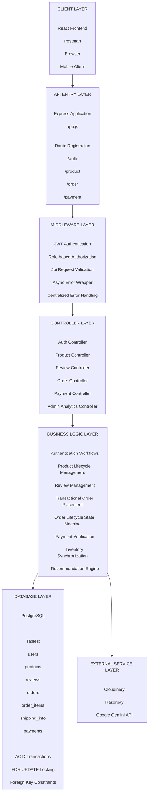
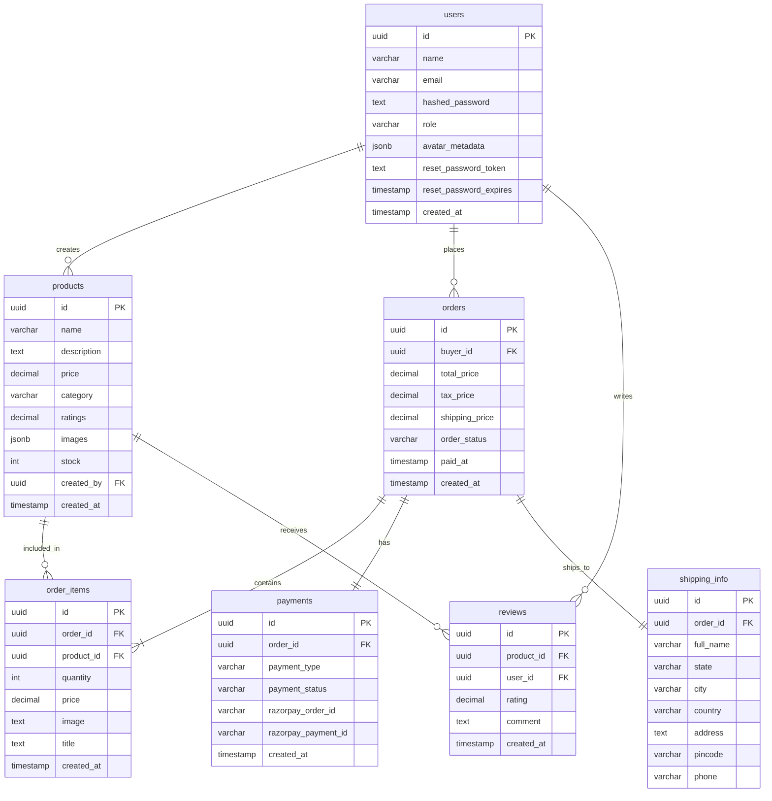
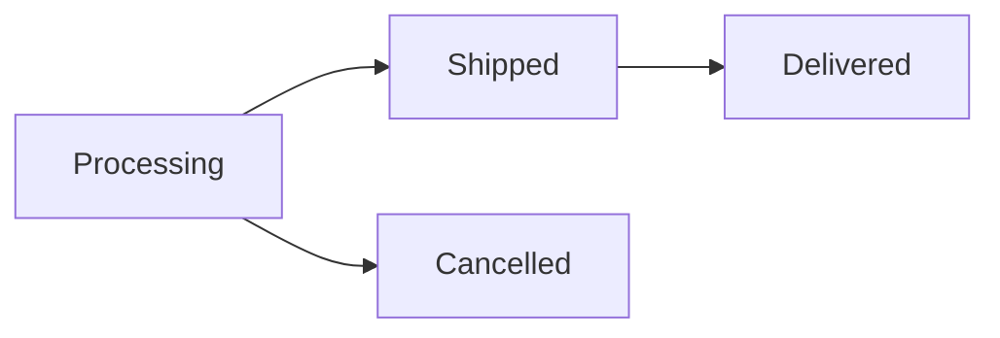
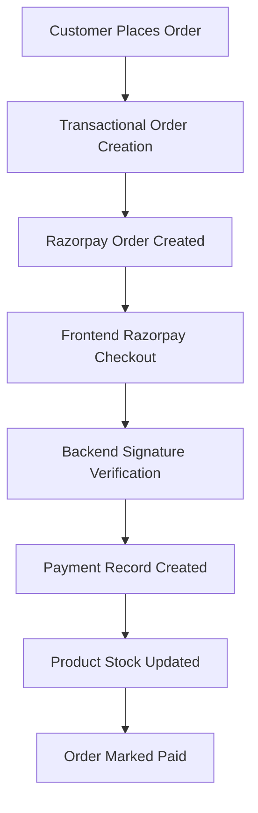

# Flint — Scalable E-Commerce Backend

> A production-inspired e-commerce backend built with Node.js, Express.js, and PostgreSQL.

---

## Table of Contents

- [Overview](#overview)
- [Tech Stack](#tech-stack)
- [Project Architecture](#project-architecture)
- [Database Schema](#database-schema)
- [Core Features](#core-features)
- [Engineering Decisions](#engineering-decisions)
- [Current Limitations](#current-limitations)
- [Engineering Challenges Solved](#engineering-challenges-solved)
- [Security Features](#security-features)
- [API Modules](#api-modules)
- [Installation](#installation)
- [Environment Variables](#environment-variables)
- [Git Milestones](#git-milestones)

---

## Overview

Flint is a production-inspired e-commerce backend built with Node.js, Express.js, and PostgreSQL.

The project focuses on solving real backend engineering challenges such as:

- Transactional order placement
- Payment settlement
- Concurrency control
- Role-based access control
- Order lifecycle management
- AI-assisted product recommendation

---

## Tech Stack

| Layer | Technology |
|---|---|
| Backend | Node.js, Express.js |
| Database | PostgreSQL |
| Authentication | JWT, bcrypt |
| Validation | Joi |
| Media Management | Cloudinary |
| Payments | Razorpay |
| AI Integration | Google Gemini API |

---

## Project Architecture



---

## Database Schema

Main entities: `users`, `products`, `reviews`, `orders`, `order_items`, `shipping_info`, `payments`



---

## Core Features

### Authentication & Account Management

- User registration
- Login/logout
- JWT authentication
- Password reset via email
- Profile management

### Product Management

- Create products
- Update products
- Delete products
- Upload product images
- Advanced filtering and search

### Reviews & Ratings

- Add product reviews
- Update reviews
- Delete reviews

### AI Recommendation Engine

- Hybrid SQL + Gemini-based product recommendation

### Order Management

- Transactional order placement
- Shipping information storage
- Customer order tracking
- Admin order lifecycle management
- Customer cancellation workflow

#### Order Lifecycle



#### Access Rules

- Customers can cancel only their own orders.
- Customers can cancel only when order status is **Processing**.
- Admins can manage order lifecycle transitions.
- **Delivered** and **Cancelled** are terminal states.

### Payment System

- Razorpay order creation
- Payment signature verification
- Payment settlement
- Inventory deduction after payment verification

#### Payment Workflow



### Admin Features

- Customer management
- Business analytics
- Order lifecycle control

---

## Engineering Decisions

- Order creation uses database transactions.
- Product rows are locked using **FOR UPDATE** to prevent race conditions.
- Duplicate cart items are merged before price calculation.
- Inventory is deducted **only after successful payment verification**.
- Payment signatures are verified using Razorpay HMAC validation.
- Duplicate payment settlement is prevented using `paid_at` checks.

---

## Current Limitations

* Payment confirmation currently relies on frontend callback verification.
* Razorpay webhooks are planned for production-grade reconciliation.
* Automated test coverage is currently manual through Postman collections.

---

## Engineering Challenges Solved

### 1. Transactional Order Placement

**Problem:** Multiple tables had to be written atomically during checkout.

**Solution:** Implemented reusable transaction wrapper using PostgreSQL transactions.

---

### 2. Race Conditions During Inventory Updates

**Problem:** Two users could attempt to purchase the same product simultaneously.

**Solution:** Used `SELECT ... FOR UPDATE` to lock product rows during critical operations.

---

### 3. Duplicate Cart Entries

**Problem:** Same product could appear multiple times in checkout payload.

**Solution:** Merged duplicate product entries before validation and pricing.

---

### 4. Payment Integrity

**Problem:** Frontend payment success could be manipulated.

**Solution:** Verified Razorpay signatures using HMAC SHA-256.

---

### 5. Inventory Consistency

**Problem:** Stock could be deducted even if payment failed.

**Solution:** Moved stock deduction after successful payment verification.

---

### 6. Order Lifecycle Enforcement

**Problem:** Users could attempt invalid order transitions.

**Solution:** Implemented state-machine based order transitions with ownership and role validation.

---

### 7. Razorpay Receipt Constraint

**Problem:** Razorpay rejected long receipt values.

**Solution:** Generated shortened deterministic receipt identifiers.

---

## Security Features

- JWT-based authentication
- Role-based authorization
- Joi request validation
- SQL parameterized queries
- Row locking using `FOR UPDATE`
- Database transactions

---

## API Modules

| Module | Base Path |
|---|---|
| Auth | `/api/v1/auth` |
| Product | `/api/v1/product` |
| Order | `/api/v1/order` |
| Payment | `/api/v1/payment` |

---

## Installation

Clone the repository:

```bash
git clone <repository-url>
cd flint-ecommerce/server
```

Install dependencies:

```bash
npm install
```

Run development server:

```bash
npm run dev
```

---

## Environment Variables

| Variable | Description |
|---|---|
| `PORT` | Server port |
| `DATABASE_URL` | PostgreSQL connection string |
| `JWT_SECRET` | JWT signing secret |
| `JWT_EXPIRES` | JWT expiry duration |
| `COOKIE_EXPIRES` | Cookie expiry duration |
| `CLOUDINARY_CLOUD_NAME` | Cloudinary cloud name |
| `CLOUDINARY_API_KEY` | Cloudinary API key |
| `CLOUDINARY_API_SECRET` | Cloudinary API secret |
| `GEMINI_API_KEY` | Google Gemini API key |
| `RAZORPAY_KEY_ID` | Razorpay key ID |
| `RAZORPAY_KEY_SECRET` | Razorpay key secret |

---

## Git Milestones

1. Authentication session lifecycle
2. Product lifecycle management
3. Reviews and ratings management
4. AI recommendation engine
5. Transactional order placement
6. Razorpay payment settlement
7. Customer order tracking
8. Admin order lifecycle management
9. Customer cancellation workflow